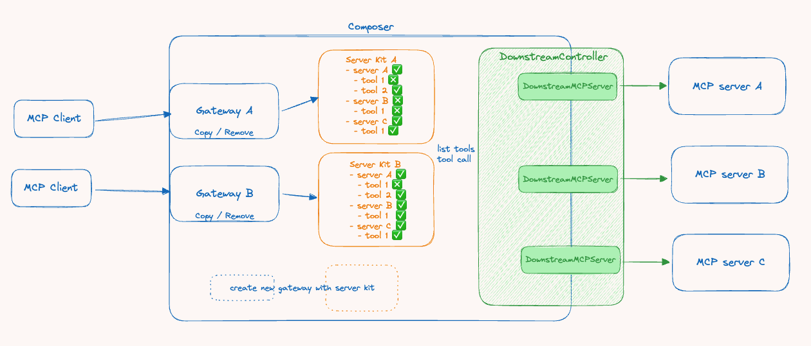

# MCP Composer


MCP Composer is a gateway service that **centrally manages** all your MCP servers. You can use it to consolidate all the MCP servers you need and open independent ports with different combinations of servers and tools for each service (like AI agents or tools) that requires access to MCP servers.

## Key Features

*   **Dynamic MCP Server Management**: Dynamically manages connections to multiple MCP servers and their tools, enabling on-the-fly activation or deactivation of services.
*   **Unified MCP Endpoint**: Exposes a single Streamable HTTP endpoint (supporting the latest MCP protocol `2026-07-28` as well as earlier revisions) that provides access to all capabilities of the managed MCP servers. A legacy SSE endpoint is also available for clients that do not support Streamable HTTP yet.
*   **Multiple Dynamic Endpoints**: Supports dynamic creation and removal of multiple gateway endpoints to accommodate different AI agents or AI tools.
*   **Independent Interface Configuration**: Each gateway independently manages its own combination of MCP servers and tools, allowing for customized service provision.

## System Architecture



### Key Terms

* **MCP Client**: External tools or AI agents and AI workflows, such as Cursor, n8n, etc.
* **Gateway[A/B]**: MCP server implementation bound to ServerKit and managed by the Composer, used to handle MCP Client connections.
* **Server Kit**: Manages and controls information about Downstream MCP servers and which tools within servers should be enabled.
* **Downstream Controller**: Responsible for controlling and managing connections to Downstream MCP servers.
* **Downstream MCP Server**: An internal object connecting to a Downstream MCP server, implemented as an internal MCP client that links to the Downstream MCP server.
* **MCP Server**: External MCP server services, such as: https://github.com/modelcontextprotocol/servers etc.
* **Composer**: Provides APIs to control and orchestrate Gateways, Server Kits, and Downstream Controllers.

## Requirements

*   Python >= 3.12
*   [uv](https://github.com/astral-sh/uv): A fast Python package installer and manager.

## Installation
### Method 1:
1.  **Clone the repository**:
    ```bash
    git clone https://github.com/htkuan/mcp-composer
    cd mcp-composer
    ```

2.  **Install dependencies**:
    Use `uv` to sync the project dependencies.
    ```bash
    make install
    # or directly use uv
    # uv sync
    ```
### Method 2:
Use Docker Compose instead of a local Python/uv setup; see [Running with Docker Compose](#running-with-docker-compose).

## Configuration

Before running the application, you need to configure the target MCP servers.

1.  Copy the example configuration file:
    ```bash
    cp mcp_servers.example.json mcp_servers.json
    ```
2.  Edit `mcp_servers.json` and enter the details of the MCP servers you want to connect to.
    - Local servers use `command` / `args` / `env` (stdio transport).
    - Remote servers use `url`. By default the Streamable HTTP transport is tried first, falling back to the legacy SSE transport. Set `"type": "http"` or `"type": "sse"` to force a specific transport.
    - The latest protocol version supported by each downstream server is negotiated automatically, so servers built with older MCP SDKs keep working.

3.  Set up environment variables:
    ```bash
    cp .env.example .env
    ```
4.  Edit the `.env` file to configure the following settings:
    - `HOST`: Server host address (default: 0.0.0.0)
    - `PORT`: Server port (default: 8000)
    - `MCP_COMPOSER_PROXY_URL`: MCP Composer proxy URL (default: http://localhost:8000)
    - `MCP_SERVERS_CONFIG_PATH`: Path to the MCP servers configuration file (default: ./mcp_servers.json)

## Running

Use `uv` to run the FastAPI application:

```bash
make run
# or directly use uv
# uv run src/main.py
```

After the service starts, you can interact with the API through the API documentation in your browser (typically at `http://127.0.0.1:8000/docs`).

Each gateway exposes two MCP endpoints (the default gateway is named `composer`):

*   **Streamable HTTP** (recommended): `http://127.0.0.1:8000/mcp/{gateway_name}/mcp`
*   **SSE** (legacy): `http://127.0.0.1:8000/mcp/{gateway_name}/sse`

## Running with Docker Compose

The Docker image bundles Python, `uv`/`uvx`, Node.js/`npx`, and the Docker CLI, so stdio servers started with `uvx`, `npx`, or `docker run` work inside the container.

1.  Create `mcp_servers.json` as described in [Configuration](#configuration). The project directory is mounted into the container, so the file is read from `/app/mcp_servers.json`.

2.  Build and start the service:
    ```bash
    make run-docker
    # or directly use docker compose
    # docker compose up -d --build
    ```
    After pulling new changes, run `docker compose up -d --build` to rebuild the image.

3.  Check the status and logs:
    ```bash
    docker compose ps                    # STATUS shows "(healthy)" once the service is ready
    docker compose logs -f mcp-composer  # shows which downstream servers connected
    ```
    The UI, API documentation, and gateway endpoints are available at the same URLs as in [Running](#running).

4.  Stop the service:
    ```bash
    docker compose down
    ```

Notes:

*   **Code changes**: `src/` is mounted from your working copy, so run `docker compose restart` to apply code or `mcp_servers.json` changes without rebuilding.
*   **Reaching services on your machine**: inside the container, `localhost` refers to the container itself. Use `host.docker.internal` instead, e.g. `"url": "http://host.docker.internal:8001/mcp"`. This also applies to containers started by `docker run` entries. On Linux, add `extra_hosts: ["host.docker.internal:host-gateway"]` to the service in `docker-compose.yml`.
*   **Docker-based MCP servers**: the host's Docker socket is mounted, so `"command": "docker"` entries start sibling containers on your host. This gives the container full access to your Docker daemon.
*   **Environment variables**: `MCP_SERVERS_CONFIG_PATH` and `MCP_COMPOSER_PROXY_URL` are set in `docker-compose.yml` and take precedence over `.env`. The published port is fixed to `8000:8000`; if you change `PORT`, update `ports` as well.

## Development

The project includes a `Makefile` to simplify common development tasks:

*   **Install dependencies**: `make install`
*   **Format and check code**: `make format` (using Ruff)
*   **Run the application**: `make run`
*   **Run with Docker Compose**: `make run-docker`

## Contributing

Contributions to this project are welcome! Please follow the standard GitHub Fork & Pull Request workflow. It's recommended to create an Issue for discussion before submitting a Pull Request.
