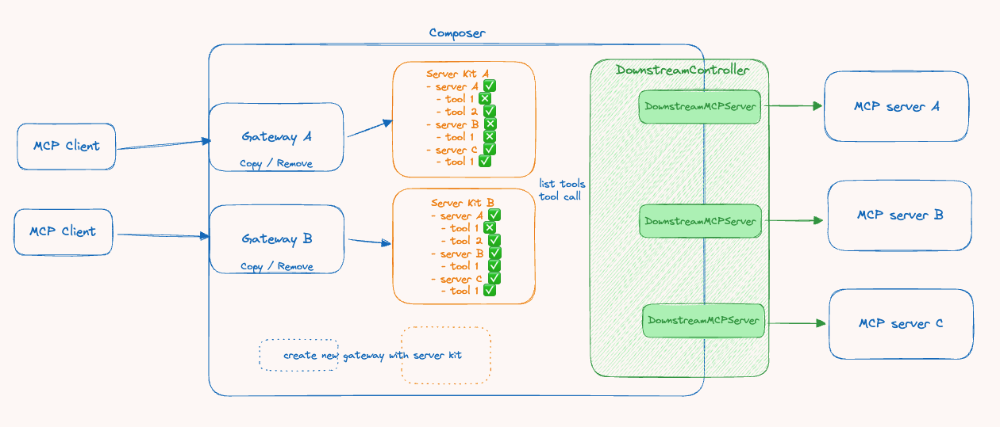

# MCP Composer


MCP Composer is a gateway service that **centrally manages** all your MCP servers. You can use it to consolidate all the MCP servers you need and open independent ports with different combinations of servers and tools for each service (like AI agents or tools) that requires access to MCP servers.

## Key Features

*   **Dynamic MCP Server Management**: Dynamically manages connections to multiple MCP servers and their tools, enabling on-the-fly activation or deactivation of services.
*   **Unified SSE Interface**: Exposes a single Server-Sent Events (SSE) interface that provides access to all capabilities of the managed MCP servers.
*   **Multiple Dynamic Endpoints**: Supports dynamic creation and removal of multiple SSE endpoints to accommodate different AI agents or AI tools.
*   **Independent Interface Configuration**: Each SSE interface independently manages its own combination of MCP servers and tools, allowing for customized service provision.

## System Architecture



### Key Terms

* **MCP Client**: External tools or AI agents and AI workflows, such as Cursor, n8n, etc.
* **Gateway[A/B]**: MCP server implementation bound to ServerKit and managed by the Composer, used to handle MCP Client connections.
* **Server Kit**: Manages and controls information about Downstream MCP servers and which tools within servers should be enabled.
* **Downstream Controller**: Responsible for controlling and managing connections to Downstream MCP servers.
* **Downstream MCP Server**: An internal object connecting to a Downstream MCP server, implemented as an internal MCP client that links to the Downstream MCP server.
* **MCP Server**: External MCP server services, such as: https://github.com/modelcontextprotocol/servers etc.
* **Composer**: Provides APIs to control and orchestrate Gateways, Server Kits, and Downstream Controllers.

## Requirements

*   Python >= 3.12
*   [uv](https://github.com/astral-sh/uv): A fast Python package installer and manager.

## Installation

1.  **Clone the repository**:
    ```bash
    git clone https://github.com/htkuan/mcp-composer
    cd mcp-composer
    ```

2.  **Install dependencies**:
    Use `uv` to sync the project dependencies.
    ```bash
    make install
    # or directly use uv
    # uv sync
    ```

## Configuration

Before running the application, you need to configure the target MCP servers.

1.  Copy the example configuration file:
    ```bash
    cp mcp_servers.example.json mcp_servers.json
    ```
2.  Edit `mcp_servers.json` and enter the details of the MCP servers you want to connect to.

3.  Set up environment variables:
    ```bash
    cp .env.example .env
    ```
4.  Edit the `.env` file to configure the following settings:
    - `HOST`: Server host address (default: 0.0.0.0)
    - `PORT`: Server port (default: 8000)
    - `MCP_COMPOSER_PROXY_URL`: MCP Composer proxy URL (default: http://localhost:8000)
    - `MCP_SERVERS_CONFIG_PATH`: Path to the MCP servers configuration file (default: ./mcp_servers.json)

## Running

Use `uv` to run the FastAPI application:

```bash
make run
# or directly use uv
# uv run src/main.py
```

After the service starts, you can interact with the API through the API documentation in your browser (typically at `http://127.0.0.1:8000/docs`).

## Development

The project includes a `Makefile` to simplify common development tasks:

*   **Install dependencies**: `make install`
*   **Format and check code**: `make format` (using Ruff)
*   **Run the application**: `make run`

## Contributing

Contributions to this project are welcome! Please follow the standard GitHub Fork & Pull Request workflow. It's recommended to create an Issue for discussion before submitting a Pull Request.
